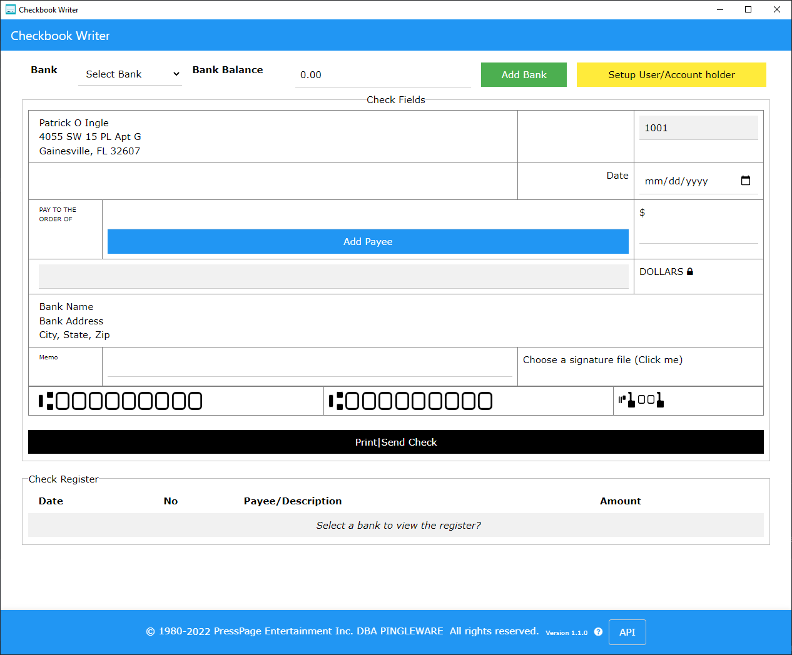

# Checkbook
Checkbook is a self-contained API server. Back in the early 1980's, I developed a Checkwriter device using a two line alpha numeric LCD display, a small QWERTY keyboard and an embedded ink jet printer with sealed check cartridge to print the check and eject. There was no internet nor any smart phones or IOT devices. This project is a reconcilation of that project using current technology.

# Preview

# Official User Guide
The Official User Guide is available at https://www.amazon.com/dp/B09Q28DRTJ

# Release Schedule
Whenever the code base is updated, a new standalone executable is created and replaced with the existing executable.

    Version         Date                Description
    1.0.0         01/09/2022        Initial release
    1.1.0                           Added new API: purgeCheckRegister, newCheckRegisterItem

# EOL or End-of-Life
When a piece of software is useful, there should never be an EOL doctrine. The intention for this application is to achieve immoratlity ;).

At some point of time in the future, this project may appear to be dead and abandon. The opposite will be true!

When this project reaches that stage, this project has matured to a level where maintenance is minimal (mostly updating to latest version of Node).

    Patrick Ingle
    Developer
    January 9, 2022